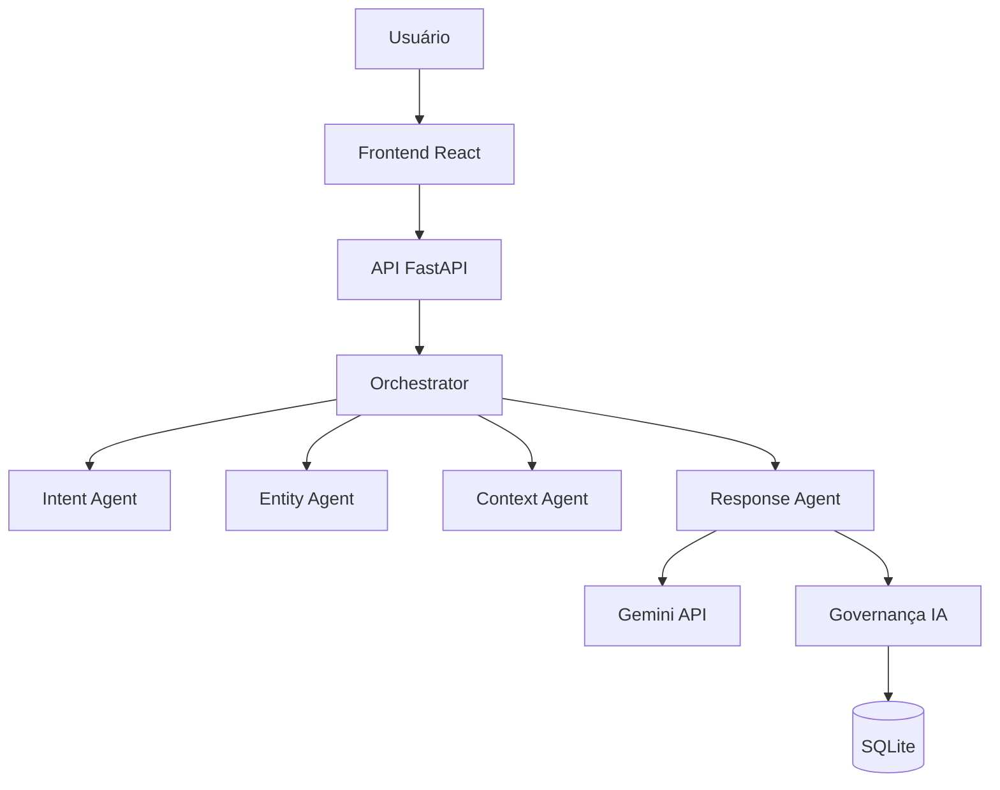

# FIAP - Faculdade de Informática e Administração Paulista

<p align="center">
<a href="https://www.fiap.com.br/">

</a>
</p>

<br>

# YOUVISA – Plataforma Inteligente de Atendimento Multicanal (Sprint 4)

---

## 🎯 Visão do Projeto

O **YOUVISA** é uma plataforma inteligente de análise e validação de documentos que utiliza **Inteligência Artificial Generativa e NLP** para auxiliar usuários em processos administrativos.

Nesta versão (Sprint 4), o sistema evolui para uma arquitetura mais robusta, baseada em **agentes inteligentes**, capazes de interpretar intenções, extrair informações e gerar respostas contextualizadas com base no estado do processo.

---

## 👨‍💻 Equipe de Desenvolvimento

- Luana Porto Pereira Gomes  
- Luma Oliveira  
- Priscilla Oliveira  
- Paulo Bernardes

---

## 👩‍🏫 Professores:
### Tutor(a)
- <a href="https://www.linkedin.com/in/leonardoorabona/">Leonardo Ruiz</a>
### Coordenador(a)
- <a href="https://www.linkedin.com/in/profandregodoi/">André Godoi</a>

---

## 📘 Introdução

Este projeto foi desenvolvido no **Enterprise Challenge FIAP** e representa a evolução das sprints anteriores.

Na Sprint 4, o foco foi transformar o chatbot em um sistema mais inteligente, incorporando:

- arquitetura multiagente  
- processamento de linguagem natural (NLP)  
- histórico de conversas  
- melhoria na interpretação de intenções  

---

## 🎯 Objetivo da Sprint 4

A Sprint 4 teve como objetivo:

- implementar agentes inteligentes especializados  
- melhorar a compreensão de linguagem natural  
- registrar histórico de interações  
- evoluir o pipeline do chatbot  
- aumentar a robustez e rastreabilidade do sistema  

---

## 🤖 Arquitetura Multiagente

O sistema utiliza múltiplos agentes especializados para processar as interações do usuário.

### 🔄 Fluxo do Chatbot
Usuário → Chatbot → Orchestrator →
Intent Agent → Entity Agent → Context Agent → Response Agent → Banco de Dados

---

## 🧠 Agentes Implementados

### 🔹 Intent Agent
Responsável por identificar a intenção do usuário.

Exemplos:
- consultar status  
- verificar documentos  
- dúvidas gerais  

---

### 🔹 Entity Agent
Responsável por extrair informações relevantes da mensagem.

Exemplos:
- tipo de documento  
- nome de arquivo  
- contexto da solicitação  

---

### 🔹 Context Agent
Responsável por recuperar o estado atual do processo do usuário.

---

### 🔹 Response Agent
Responsável por gerar a resposta final utilizando:

- dados estruturados  
- contexto do usuário  
- IA generativa (Google Gemini)  

---

## 🧠 Processamento de Linguagem Natural (NLP)

O sistema utiliza NLP para:

- classificação de intenções  
- extração de entidades  
- estruturação de prompts para IA  

Diretório principal: backend/src/nlp/

---

## 🛡 Governança de IA

O sistema possui um módulo de governança responsável por registrar todas as interações da IA.

Arquivo: backend/src/nlp/ai_governance.py

Registra:

- pergunta do usuário  
- resposta gerada  
- data/hora  

Isso permite:

- auditoria  
- rastreabilidade  
- análise de comportamento  

---

## 💾 Histórico de Conversas

Funcionalidade implementada nesta sprint:

- armazenamento em SQLite  
- recuperação via endpoint `/chat/history`  
- exibição no frontend  

Benefícios:

- melhor experiência do usuário  
- análise de interações  
- suporte a decisões  

---

## ⚠ Tratamento de Erros (Fallback)

Caso a IA falhe:

- o sistema retorna resposta baseada no estado do processo  
- garante continuidade do serviço  

---

## 🏗 Arquitetura da Solução



---

## 📂 Estrutura de Pastas

```
backend/src/
├ api/
├ models/
├ nlp/
│ ├ classifier.py
│ ├ gemini_service.py
│ ├ ai_governance.py
│ ├ intent_agent.py
│ ├ entity_agent.py
│ ├ context_agent.py
│ └ response_agent.py
├ main.py

frontend/src/

```
---

## ⚙️ Tecnologias Utilizadas

Backend: <br>
    - Python <br>
    - FastAPI <br>
    - SQLite <br>
    - Google Gemini API <br>
    - NLP <br>
Frontend: <br>
    - React <br>
    - TypeScript <br>
    - Vite <br>

---

## 🚀 Como Executar

### Backend: Rode no terminal<br>
    cd backend/src 
    pip install fastapi uvicorn google-genai python-multipart 
    uvicorn main:app --reload 
### Frontend: <br>
    cd frontend 
    npm install 
    npm run dev 

---

## 🤖 Chatbot YOUVISA

### O chatbot é capaz de:
    entender intenção do usuário
    extrair informações automaticamente
    utilizar contexto do processo
    gerar respostas inteligentes
    registrar histórico

---

## 🎥 Vídeo Demonstrativo: 
